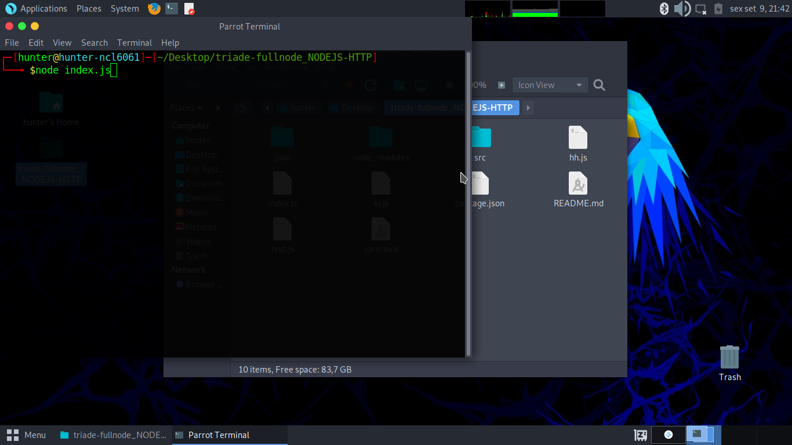

# TRÍADE-FULLNODE

## What is TRÍADE-FULLNODE?
<p>A FULLNODE is a program that stores and shares all database from the network, and, stores and shares all the logic of this network's consent and cryptography.</br>Samewise, TRÍADE-FULLNODE is one of these FULLNODES running under a TRÍADE-NETWORK.</p>

___

## Requirement to run a TRÍADE-FULLNODE?
<ul>
    <li>NODEJS (+12.22.12)</li>
    <li>YARN (+1.22.19)</li>
</ul>

Verify NODE's version

```bash
$ node -v
// v12.22.12
```
If returns an error, you must to [install NODEJS](https://nodejs.org/en/download/)

Verify YARN's version

```bash
$ yarn -v
// 1.22.19
```
If returns an error, you must to [install YARN](https://classic.yarnpkg.com/lang/en/docs/install/)

___


## How to download a TRÍADE-FULLNODE?

 | File:                     | Version:      | Size:   | Offline Installation: |
 | ------------------------- | :-----------: | :-----: | --------------------: |
 | [triade-fu...DEJS-HTTP.zip](https://github.com/hunterbianchi/triade-fullnode/archive/refs/heads/main.zip) | LTS (0.0.3)   | 27.013  | true                  |
 | [triade-fu...DEJS-HTTP.zip](https://github.com/hunterbianchi/triade-fullnode/archive/refs/heads/main.zip) | LTS (0.0.3)   | 2.013   | false                 |
 | [triade-fu...DEJS-HTTP.zip](https://github.com/hunterbianchi/triade-fullnode/archive/refs/heads/main.zip) | 0.0.4         | 28.137  | true                  |
 | [triade-fu...DEJS-HTTP.zip](https://github.com/hunterbianchi/triade-fullnode/archive/refs/heads/main.zip) | 0.0.4         | 2.013   | false                 |

You can download the program files from:
### - [downloadzip](#how-to-download-a-tríade-fullnode)
### - [TRÍADE-CORE's GitHub repository](https://github.com/hunterbianchi/triade-fullnode),
### - [using GIT CLI](#using-git-cli):

```bash
$ git --version
// git version 2.34.1
```

If returns an error, you must to [install GIT](https://git-scm.com/downloads)

After install GIT BASH, select a folder and clone repository:

```bash
$ cd Desktop

$ git clone git@github.com:hunterbianchi/triade-fullnode.git
```

Then, confirm if there is a donnloaded zip file at the folder you choose earlier and extract it like the image below:

<div>
    <br/>
</div>

___

## How to run a TRÍADE-FULLNODE?

After [download the fullnode's main folder](#how-to-download-a-tríade-fullnode), unzip folder and open it.

<div>
    <br/>
</div></br></br>

Then, open the terminal there. </br></br>

<div>
    <br/>
</div></br></br>

On terminal just run index.js file using NODEJS:

```bash
$ node index.js
```

<div>
    <br/>
</div></br></br>

Done! The TRÍADE-FULLNODE is running... </br></br>

___